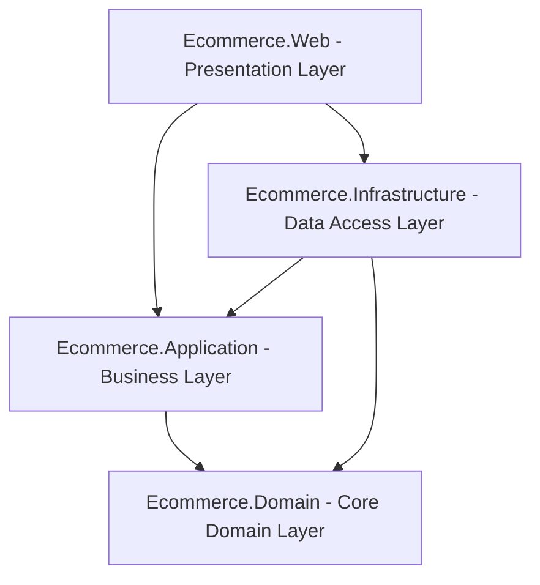

# 🛒 Cartivo - Full-Stack Enterprise E-Commerce Platform

[](https://dotnet.microsoft.com/)
[](https://docs.microsoft.com/en-us/dotnet/csharp/)
[](https://docs.microsoft.com/en-us/ef/core/)
[](https://www.microsoft.com/sql-server)
[](https://getbootstrap.com/)
[](https://blog.cleancoder.com/uncle-bob/2012/08/13/the-clean-architecture.html)
[](LICENSE)

**Cartivo** is an enterprise-grade, full-featured E-Commerce web application built using **ASP.NET Core 8 MVC**, **Entity Framework Core 8**, **SQL Server**, and **Bootstrap 5.3**. Engineered with strict adherence to **Clean Architecture** and **Domain-Driven Design** principles, Cartivo provides a seamless shopping experience for customers and a powerful administration portal for store owners.

---

## 📑 Table of Contents

- [🏗️ Clean Architecture Overview](#-clean-architecture-overview)
- [✨ Key Features & Modules](#-key-features--modules)
  - [🛒 Customer Storefront](#-customer-storefront)
  - [🛡️ Admin Portal (`/Admin`)](#-admin-portal-admin)
  - [💳 Digital Wallet & Loyalty System](#-digital-wallet--loyalty-system)
  - [🔄 Returns & Logistics Management](#-returns--logistics-management)
- [💡 Architectural Patterns & Engineering Highlights](#-architectural-patterns--engineering-highlights)
- [🔑 Demo Credentials](#-demo-credentials)
- [🛠️ Getting Started](#️-getting-started)
  - [Prerequisites](#prerequisites)
  - [Installation & Setup](#installation--setup)
- [🎟️ Pre-Configured Demo Coupons](#️-pre-configured-demo-coupons)
- [📂 Project Structure](#-project-structure)
- [📄 License](#-license)

---

## 🏗️ Clean Architecture Overview

The solution is divided into four loosely-coupled layers adhering to Clean Architecture guidelines:



```
Ecommerce.sln
│
├── src/
│   ├── Ecommerce.Domain/             # Core Domain Models, Enums, Base Entity
│   │   ├── Common/                   # BaseEntity (Id, CreatedAt, UpdatedAt, Soft-Delete)
│   │   ├── Entities/                 # Product, Category, Brand, Order, CartItem, Address, Coupon, etc.
│   │   └── Enums/                    # OrderStatus, PaymentStatus, PaymentMethod, DiscountType, etc.
│   │
│   ├── Ecommerce.Application/        # Contracts, DTOs & Business Interfaces
│   │   ├── Interfaces/               # Service & Repository abstractions (IProductService, IUnitOfWork, etc.)
│   │   └── DTOs/                     # Request/Response ViewModels & Transfer Objects
│   │
│   ├── Ecommerce.Infrastructure/     # Database, EF Core, Repositories & Implementations
│   │   ├── Data/                     # ApplicationDbContext, Migrations, DbInitializer (Seed Data)
│   │   ├── Repositories/             # GenericRepository<T>, UnitOfWork
│   │   └── Services/                 # ProductService, OrderService, CartService, CouponService, etc.
│   │
│   └── Ecommerce.Web/                # Presentation Layer (ASP.NET Core 8 MVC)
│       ├── Areas/Admin/              # Admin Portal (Dashboard, Products, Orders, Categories, Coupons)
│       ├── Controllers/              # Storefront Controllers (Home, Shop, Cart, Checkout, Orders, Account)
│       ├── Views/                    # Razor Views, ViewComponents, Partials
│       └── wwwroot/                  # Client assets (Custom CSS, JS, Bootstrap, Chart.js, Icons)
```

---

## ✨ Key Features & Modules

### 🛒 Customer Storefront
* **Dynamic Homepage**: Hero promo banners, category spotlight cards, featured deals, trending products, and new arrivals.
* **Smart Catalog & Filter Engine**:
  * Real-time search with debounced keyword lookup.
  * Multi-select category and brand filters.
  * Price range slider, stock availability toggle, and multi-criteria sorting (Price Low/High, Rating, Popularity, Newest).
* **Rich Product Detail Pages**:
  * Multi-image thumbnail gallery.
  * Variant selection (Size, Color, Storage / RAM).
  * Real-time stock status badge and SKU display.
  * Verified buyer customer reviews & star rating system.
  * Related products recommendations.
* **Shopping Cart & Checkout**:
  * Dynamic AJAX quantity increment/decrement.
  * Instant subtotal, GST (18%), and free shipping threshold (Free shipping above ₹999).
  * Guest session cart merged seamlessly with user cart upon authentication.
  * Saved address book with multi-address management (Home, Office, etc.).
  * Multiple payment options: **Cash on Delivery (COD)**, **Credit/Debit Card**, **UPI**, **Net Banking**, and **Cartivo Digital Wallet**.
* **Order Tracking & Invoices**:
  * Visual 5-step order timeline: `Confirmed` ➔ `Processing` ➔ `Shipped` ➔ `Out for Delivery` ➔ `Delivered`.
  * Real-time courier partner and tracking reference updates.
  * Printable and downloadable tax invoice receipt.

---

### 🛡️ Admin Portal (`/Admin`)
* **Executive Analytics Dashboard**:
  * Metric summary cards: Total Revenue, Total Orders, Active Customers, Low-Stock Alerts.
  * Visual sales performance graphs powered by **Chart.js**.
  * Quick-access recent orders feed with status change controls.
* **Catalog Management**:
  * Full CRUD for **Products**, **Categories**, and **Brands**.
  * Auto-generated SEO friendly URL slugs, SKU generation, and image gallery uploads.
  * Real-time low stock indicators and inventory quantity management.
* **Order Fulfillment Center**:
  * Order status workflow management with audit history logs.
  * Logistics assignment: Courier partner, Tracking Number, Estimated Delivery Date.
  * Return requests review and automated wallet refund processing.
* **Promotions & Coupon Engine**:
  * Create percentage-based or flat discount coupon codes.
  * Set expiration dates, maximum usage limits, and minimum cart spend rules.
* **Customer Care & Feedback**:
  * Review moderation: Approve or dismiss submitted product reviews.
  * Contact Us Support Inbox: Read, reply, and track customer inquiries.

---

### 💳 Digital Wallet & Loyalty System
* **User Wallet**: Every registered user gets an integrated digital wallet with instant top-up options.
* **Seamless Checkout**: Pay directly using wallet balance for 1-click checkout.
* **Loyalty Points**: Earn reward points on every completed purchase.
* **Transaction History**: Complete passbook of credits, debits, refunds, and cashback transactions with timestamped audit trails.

---

### 🔄 Returns & Logistics Management
* **Self-Service Returns**: Customers can request returns with reasons and custom comments directly from their order details page.
* **Admin Refund Approval**: Admin can approve returns and automatically credit the refund amount directly into the customer's wallet.
* **End-to-End Tracking**: Shipped, Out for Delivery, and Delivered timestamps tracked per order with live location updates.

---

## 💡 Architectural Patterns & Engineering Highlights

1. **Repository & Unit of Work Pattern**:
   Encapsulates data access logic and guarantees that all related operations execute in a unified transaction context.

2. **Atomic Database Transactions**:
   Order placement, stock reduction, coupon validation, and wallet deductions are executed inside an `IDbContextTransaction` ensuring ACID compliance and zero race conditions.

3. **Soft Delete with EF Core Global Query Filters**:
   Entities inherit from `BaseEntity` with `IsDeleted`. Global query filters (`HasQueryFilter(e => !e.IsDeleted)`) guarantee deleted records are transparently excluded across all queries.

4. **High-Performance Read Queries**:
   Read-only operations use `.AsNoTracking()` to eliminate Entity Framework change tracker overhead and maximize query throughput.

5. **Financial Precision**:
   All monetary columns (`BasePrice`, `GrandTotal`, `DiscountAmount`, `WalletBalance`) are strictly mapped to `decimal(18, 2)` to eliminate floating-point rounding errors.

---

## 🔑 Demo Credentials

| Role | Email | Password | Access Level |
|---|---|---|---|
| **Administrator** | `admmin123@gmail.com` | `Admin123` | Full Storefront & Admin Portal (`/Admin`) |
| **Customer** | `customer@ecommerce.com` | `Customer@123` | Storefront, Cart, Checkout, Wallet, Orders |

> [!TIP]
> On application startup, `DbInitializer.SeedAsync()` will automatically seed default roles, demo accounts, sample categories, brands, products, and active coupons.

---

## 🛠️ Getting Started

### Prerequisites
* [.NET 8.0 SDK](https://dotnet.microsoft.com/download/dotnet/8.0)
* [SQL Server](https://www.microsoft.com/sql-server) or **SQL Server LocalDB** (pre-installed with Visual Studio)
* [Visual Studio 2022](https://visualstudio.microsoft.com/) / [VS Code](https://code.visualstudio.com/) / [JetBrains Rider](https://www.jetbrains.com/rider/)

### Installation & Setup

1. **Clone the Repository**:
   ```bash
   git clone https://github.com/your-username/ecommerce-dotnet8.git
   cd ecommerce-dotnet8
   ```

2. **Configure Connection String**:
   Open `src/Ecommerce.Web/appsettings.json` and adjust the connection string if needed:
   ```json
   "ConnectionStrings": {
     "DefaultConnection": "Server=(localdb)\\mssqllocaldb;Database=EcommerceDb_Net8;Trusted_Connection=True;MultipleActiveResultSets=true;TrustServerCertificate=True"
   }
   ```

3. **Restore Dependencies & Build**:
   ```bash
   dotnet restore
   dotnet build
   ```

4. **Run Database Migrations (Optional - runs automatically on startup)**:
   ```bash
   dotnet ef database update --project src/Ecommerce.Infrastructure --startup-project src/Ecommerce.Web
   ```

5. **Run the Application**:
   ```bash
   dotnet run --project src/Ecommerce.Web
   ```

6. **Open in Browser**:
   * **Storefront**: `https://localhost:5001` or `http://localhost:5000`
   * **Admin Area**: `https://localhost:5001/Admin`

---

## 🎟️ Pre-Configured Demo Coupons

Test the checkout discount engine using these active seed coupons:

| Coupon Code | Discount Type | Value | Min Order | Description |
|---|---|---|---|---|
| `WELCOME10` | Percentage | 10% OFF | ₹500 | 10% discount for first orders |
| `FLAT500` | Fixed Amount | ₹500 OFF | ₹2,000 | Flat ₹500 off on bulk orders |
| `SUPERDEAL` | Percentage | 20% OFF | ₹1,500 | Special festival offer |

---

## 📂 Project Structure

```
src/
├── Ecommerce.Domain/
│   ├── Common/              # BaseEntity, IAuditableEntity
│   ├── Entities/            # Product, Order, Category, Brand, CartItem, Address, Coupon, WalletTransaction, ContactMessage
│   └── Enums/               # OrderStatus, PaymentStatus, PaymentMethod, DiscountType, WalletTransactionType
│
├── Ecommerce.Application/
│   ├── DTOs/                # ProductDTO, OrderDTO, CartDTO, CheckoutDTO, WalletDTOs, ContactMessageDTO
│   └── Interfaces/          # IProductService, IOrderService, ICartService, IWalletService, IUnitOfWork, IGenericRepository
│
├── Ecommerce.Infrastructure/
│   ├── Data/                # ApplicationDbContext, ModelConfigurations, DbInitializer
│   ├── Migrations/          # EF Core Code-First Migrations
│   ├── Repositories/        # GenericRepository<T>, UnitOfWork
│   └── Services/            # Service Implementations (ProductService, OrderService, etc.)
│
└── Ecommerce.Web/
    ├── Areas/Admin/         # Admin Controllers (Dashboard, Products, Orders, Categories, Brands, Coupons, Reviews, Messages)
    ├── Controllers/         # Customer Controllers (Home, Shop, Cart, Checkout, Orders, Wishlist, Account)
    ├── Views/               # Razor Views, Partial Views, Layouts
    └── wwwroot/             # CSS stylesheets, Javascript bundles, Vendor libraries, Uploads
```

---

## 📄 License

This project is licensed under the **MIT License** - see the [LICENSE](LICENSE) file for details.
